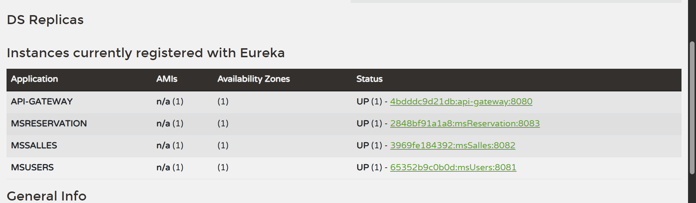
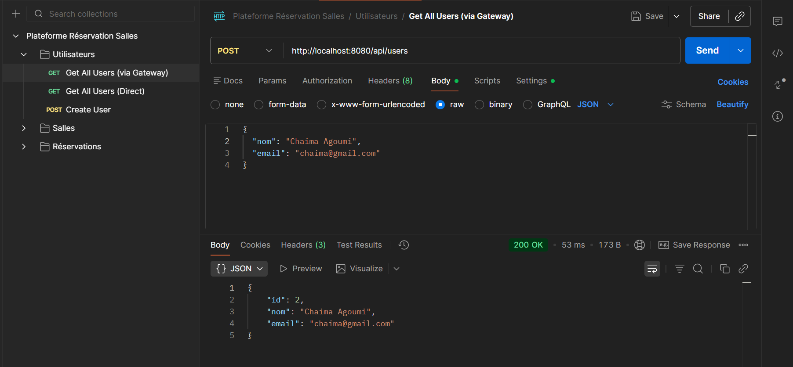
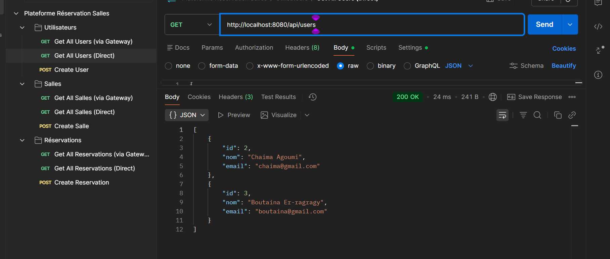
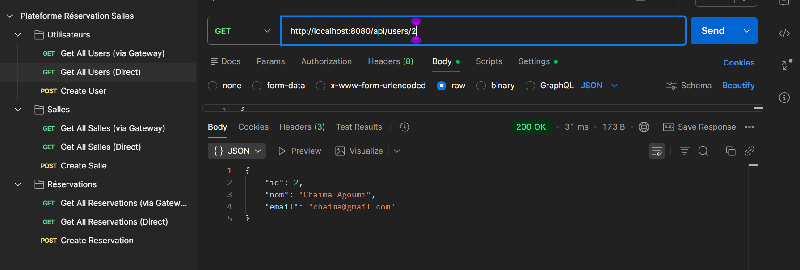
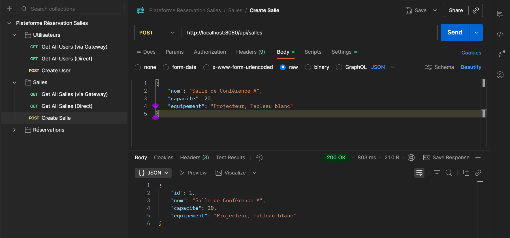
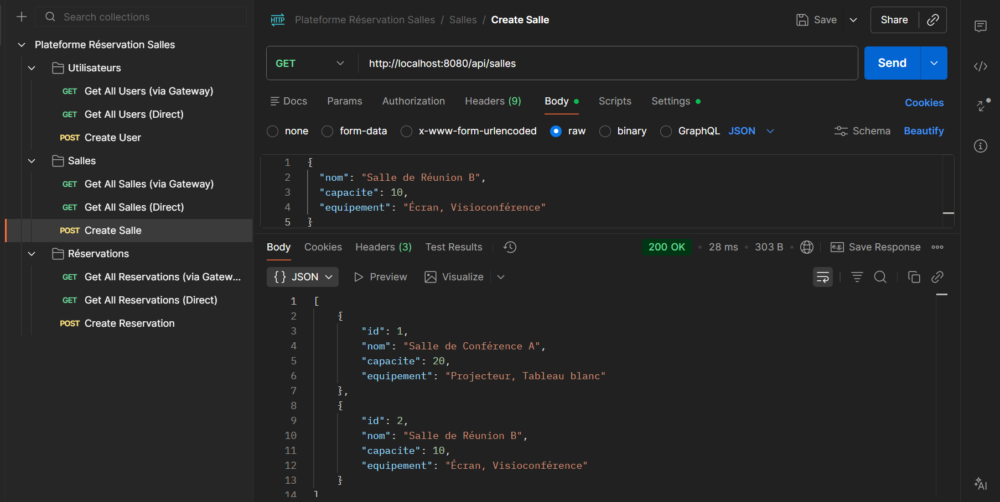
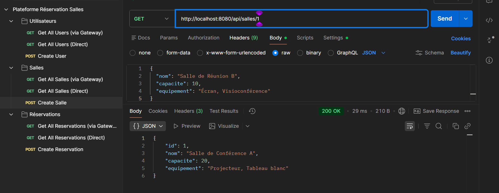
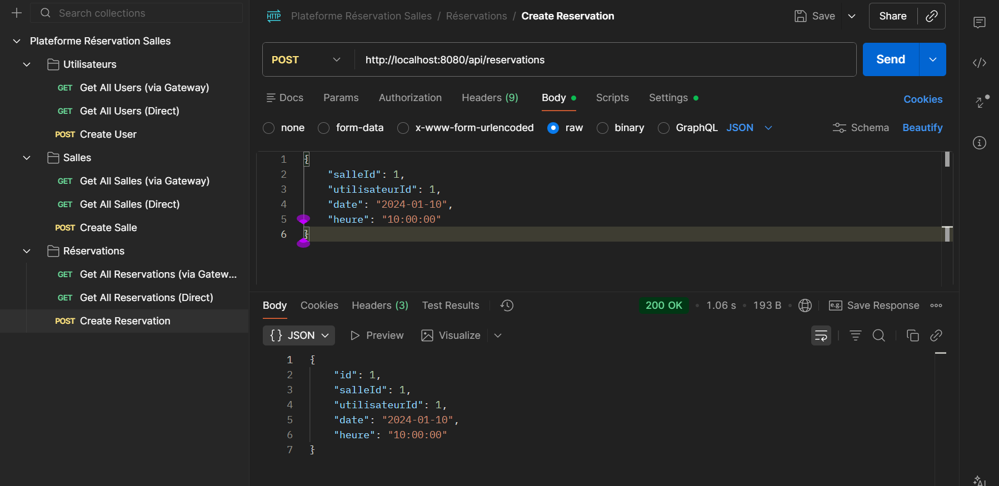
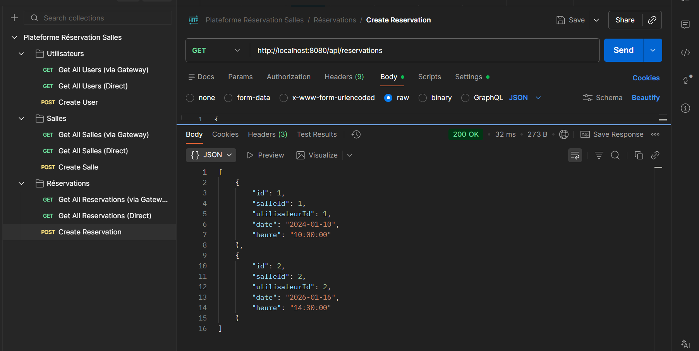
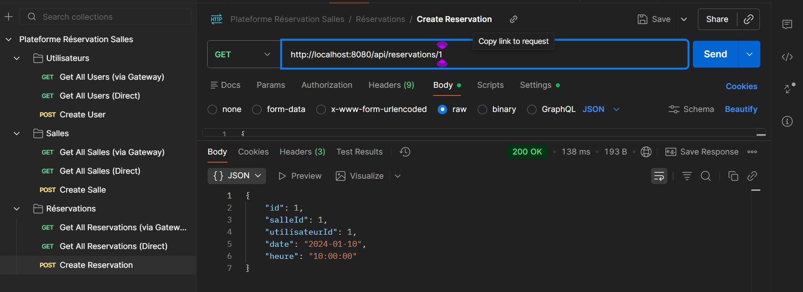

# Plateforme de Réservation de Salles

Plateforme de gestion de réservation de salles basée sur une architecture microservices avec Spring Boot, Eureka et API Gateway.

## Architecture

Ce projet utilise une architecture microservices comprenant:

- **Eureka Server** (Port 8761): Service de découverte et registre des microservices
- **API Gateway** (Port 8080): Point d'entrée unique pour tous les microservices
- **MS Users**: Gestion des utilisateurs
- **MS Salles**: Gestion des salles
- **MS Reservation**: Gestion des réservations
- **MySQL Database**: Base de données partagée

## Prérequis

- Docker & Docker Compose
- Java 17+
- Maven 3.8+

## Démarrage

### Lancer tous les services

```bash
docker-compose up -d
```

### Vérifier les services

- **Eureka Dashboard**: http://localhost:8761
- **API Gateway**: http://localhost:8080

### Arrêter les services

```bash
docker-compose down
```

## Eureka - Services Enregistrés

Tous les microservices sont automatiquement enregistrés dans Eureka:



## API Endpoints

Tous les endpoints sont accessibles via l'API Gateway sur le port **8080**.

### 1. Utilisateurs (MS Users)

#### Créer un utilisateur

**POST** `http://localhost:8080/api/users`

```json
{
  "nom": "Chaima Agoumi",
  "email": "chaima@gmail.com"
}
```



#### Récupérer tous les utilisateurs

**GET** `http://localhost:8080/api/users`



#### Récupérer un utilisateur par ID

**GET** `http://localhost:8080/api/users/{id}`



---

### 2. Salles (MS Salles)

#### Créer une salle

**POST** `http://localhost:8080/api/salles`

```json
{
  "nom": "Salle de Conférence A",
  "capacite": 20,
  "equipement": "Projecteur, Tableau blanc"
}
```



#### Récupérer toutes les salles

**GET** `http://localhost:8080/api/salles`



#### Récupérer une salle par ID

**GET** `http://localhost:8080/api/salles/{id}`


---

### 3. Réservations (MS Reservation)

#### Créer une réservation

**POST** `http://localhost:8080/api/reservations`

```json
{
  "salleId": 1,
  "utilisateurId": 1,
  "date": "2026-01-15",
  "heure": "10:00:00"
}
```



#### Récupérer toutes les réservations

**GET** `http://localhost:8080/api/reservations`



#### Récupérer une réservation par ID

**GET** `http://localhost:8080/api/reservations/{id}`


---

## Configuration

### API Gateway Routes

L'API Gateway route les requêtes vers les microservices appropriés:

- `/api/users/**` → MS Users
- `/api/salles/**` → MS Salles
- `/api/reservations/**` → MS Reservation

### Ports

| Service          | Port |
|------------------|------|
| Eureka Server    | 8761 |
| API Gateway      | 8080 |
| MySQL            | 3307 |

## Tests

### Avec Insomnia/Postman

Importer le fichier `insomnia_tests.json` dans Insomnia ou Postman pour avoir accès à tous les tests préconfigurés.

### Ordre de Test Recommandé

1. Démarrer l'environnement: `docker-compose up -d`
2. Vérifier Eureka: http://localhost:8761
3. Créer des utilisateurs via POST `/api/users`
4. Créer des salles via POST `/api/salles`
5. Créer des réservations via POST `/api/reservations`
6. Tester les GET pour vérifier la persistance

## Technologies Utilisées

- **Spring Boot** 3.x
- **Spring Cloud Gateway**
- **Spring Cloud Netflix Eureka**
- **Spring Data JPA**
- **MySQL** 8.0
- **Docker & Docker Compose**
- **Maven**

## Communication entre Microservices

Les microservices communiquent entre eux via:
- **Eureka** pour la découverte de services
- **OpenFeign** pour les appels REST
- **Load Balancing** automatique via Spring Cloud

## Base de Données

Chaque microservice possède sa propre base de données:
- `users_db` pour MS Users
- `salles_db` pour MS Salles
- `reservations_db` pour MS Reservation

Les bases de données sont automatiquement créées au démarrage grâce à l'option `createDatabaseIfNotExist=true`.